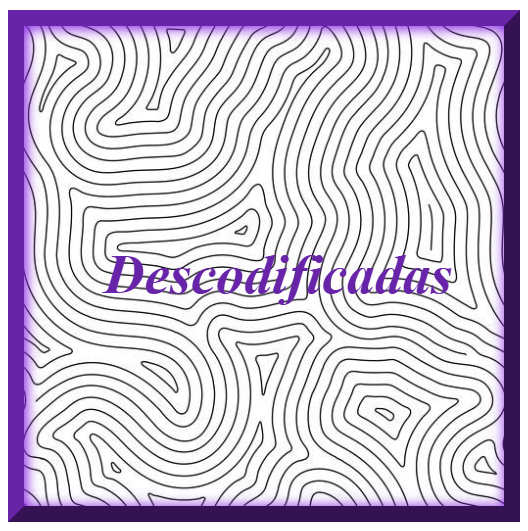

<h1 align="center"> Quadro </h1>

Atividade Descodificadas.  
<a href="https://fonsecaw.github.io/quadros/
">Link final da Atividade.</a>

  <a href="#-tecnologias">Tecnologias</a>&nbsp;&nbsp;&nbsp;|&nbsp;&nbsp;&nbsp;
  <a href="#-projeto">Curso</a>

  

 

## 🚀 Tecnologias

Esse projeto foi desenvolvido com as seguintes tecnologias:

- HTML e CSS
- Git e Github

## 💻 Curso

O Descodificadas é um curso gratuito para mulheres que desejam entrar na área da programação.

- [Faça sua inscrição](https://descodificadas.com.br/inscricao/)

- [Assistir aulas](https://www.youtube.com/watch?v=B9dyxqfj8QY&list=PLU8SAog3XwhIgMFfzOWxI2g-kmC_F7dCl&index=13)

